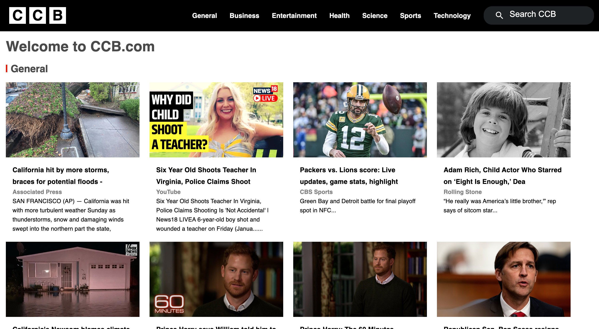
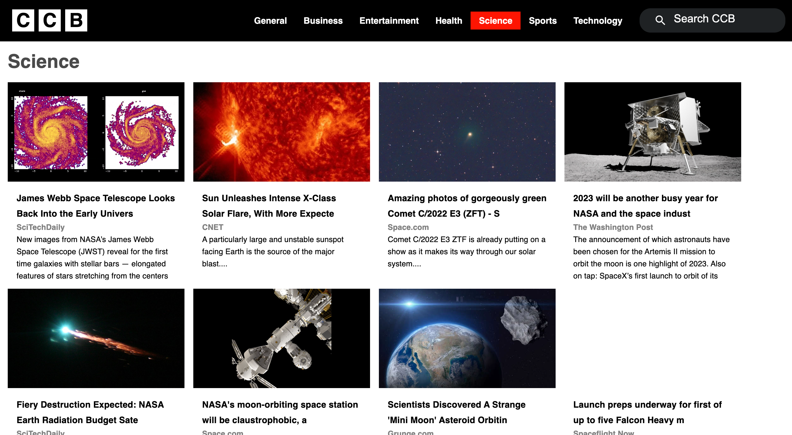
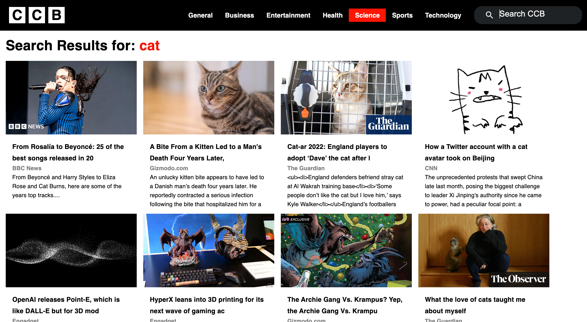

# BBC News Clone Fullstack 

This is my BBC news clone with React, JavaScript, Java, and Spring.

## Used Skills, Technology

Java, Spring, React, JavaScript, Router, Material UI, News API

## Functions

### `Home`

Displays general top news, and other 2 categories(business, health)
Navbar -> Home Logo, Category menu, Search bar
Responsive

### `Category Details`

Display top 20 news based on the selected category

### `Search`

Display news based on the word you typed on the search bar

